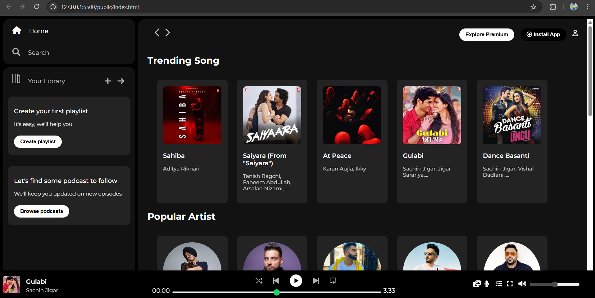

# 🎧 Spotify Clone  
*A front-end-only Spotify clone built using HTML & CSS.*

---

## 🎯 Objective
To recreate **Spotify’s web interface** using only HTML and CSS — focusing on layout, spacing, and theming.

---

## 🧩 Features
- Sidebar navigation & main content area  
- Bottom music player layout  
- Consistent Spotify-inspired theme  
- Responsive layout using grid and flexbox  

---

## 🧠 What I Learned
- Building multi-section layouts  
- Working with CSS Grid + Flexbox together  
- Managing color contrast and spacing  
- Matching design accuracy of real UIs  

---

## ⚙️ Technologies Used
- HTML5  
- CSS3 (Grid, Flexbox, Positioning)

---

## 📸 Preview

---

## 🏁 Future Improvements
- Add interactive music controls using JavaScript  
- Improve responsiveness for mobile screens  

---

*Designed & developed by Sahil Kadam 🎵*
